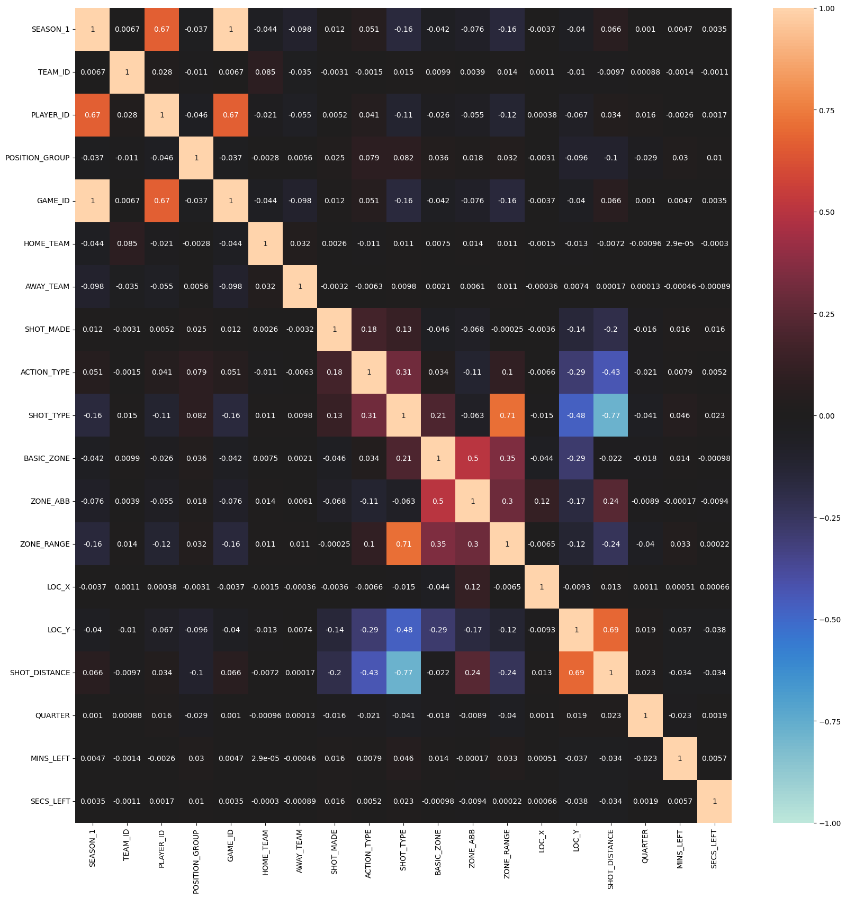
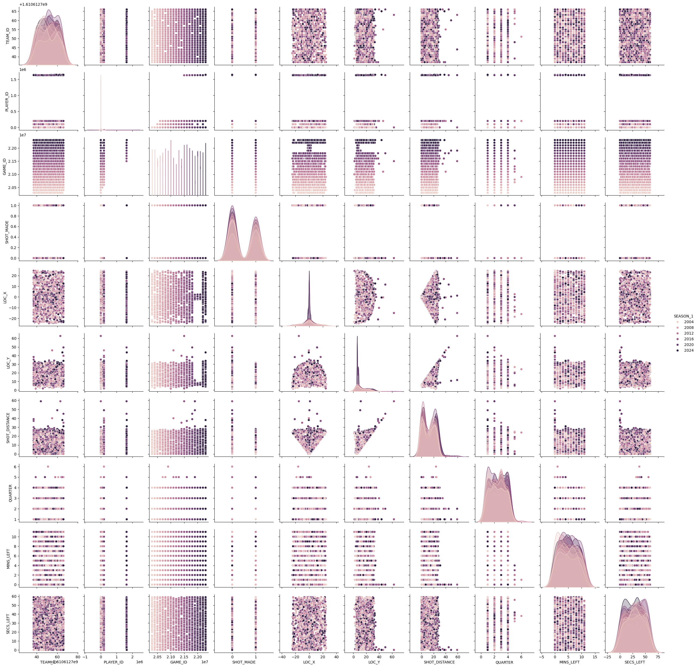
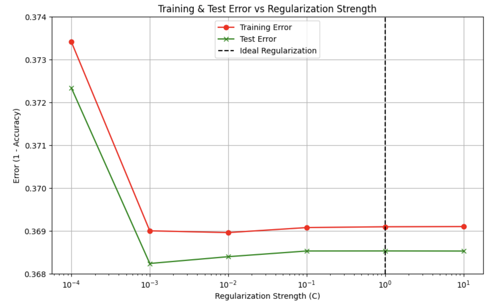
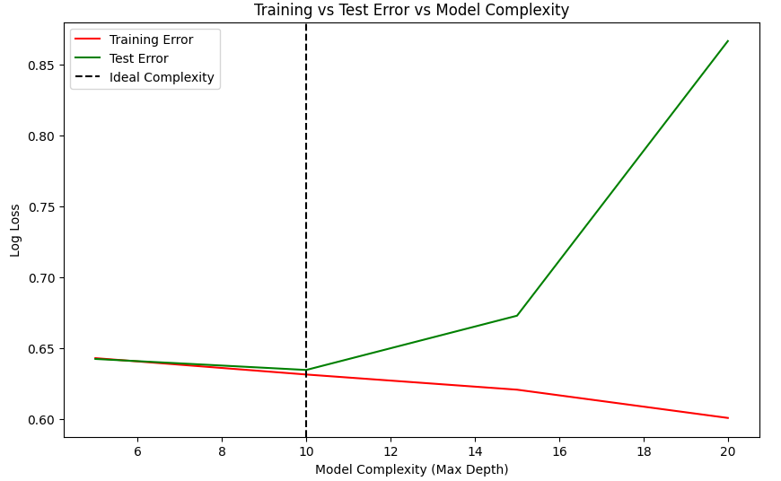

# CSE-151A-Project

## Final Report

### Notebook Files:

[Milestone II Notebook](explore.ipynb)

[Milestone III Notebook](preprocess.ipynb)

[Milestone IV Notebook](modelling.ipynb)


### INTRODUCTION

Our project aimed to develop a model to predict whether or not an NBA field goal will be made, given game and shot details. Our dataset was acquired from Kaggle, and contained NBA in-season and post-season shots taken from 2003-2024. It includes features such as cartesian coordinates of shot, player position, time left in quarter, and more. The model is trained to predict what factors lead to shot success, which would be incredibly useful to players to visualize and measure the contributing features to making points. With a reliable predictive model, we can reveal what controllable features are most valuable in ensuring that a shot is made, ultimately leading to NBA team and player success.

We developed two models, a Logistic Regression and Decision Tree predictor model, and evaluated each using performance metrics such as precision, recall, and accuracy. Ultimately, both models performed alright, but not incredibly strong.

### METHODS

#### Data Exploration
During the data exploration phase, a few basic visualizations were constructed to better understand the working data. Taking snapshots of data, features were separated into categories: identifiers (TEAM_ID, PLAYER_ID, etc), categorical data (ACTION_TYPE, SHOT_TYPE, etc), and numerical data (LOC_X, LOC_Y, SECS_LEFT, etc). The first heatmap and pairplots gave a general overview of correlation, where feature distribution and some expected correlations were noted. Next steps included a plan to encode features for streamlined analysis, as well as excluding Nan and null values.

#### Preprocessing
There was minimal work to be done for data preprocessing, as the files obtained from Kaggle were mostly cleaned, already. During the exploration phase, there were minimal irregularities and outliers. Our preprocessing consisted of encoding categorical data, dropping missing values, excluding any unrelated/duplicate features. Categorical data was one-hot encoded as observations were unordered (for example, POSITION_GROUP, HOME_TEAM). Observations with missing values were removed as there were very few and would make little difference to the final model (few out of 4.2mil total observations). Lastly, some features were dropped as they were either repeats of other features or irrelevant to data used to predict shot success. For example, GAME_ID simply provided an identification value for a single game, and didn't give any information into game shots themselves; SEASON_1 was dropped as it was a repeat of information in SEASON_2 (providing the NBA season year), but in a different format.

#### Model 1
The first constructed model was a Logistic Regression model. Our data was split 80:20 for training and testing, with scaling of numerical data post-split. Standard scaling was used for this model as it was effective for the coordinate system of locational features and other attributes. We ran classification reports on both train and test data (actual vs predicted) to evaluate performance. 

#### Model 2
The second model constructed was a Decision Tree Classifier using Gini Impurity, in order to capture greater complexity. We tested various hyperparameters to find an optimal fit, while still maintaining generalizability and preventing any model overfitting. For this model, we chose to use unscaled data to train, as it resulted in better performance and clearer decision boundaries. In a fitting graph to measure error and complexity, the Decision Tree model was fitted well, lying between under and overfitting. Similar to the Logistic Regression model, training and testing performance was observed in classification reports.


### RESULTS

#### Data Exploration
Generating heatmaps and pairplots of the data, there were a few expected trends—for example, higher correlation between shot distance vs y-coordinate, shot distance vs shot type; dense limited ranges of values for locational values (limited to court size). Otherwise, there were limited linear correlations.




#### Preprocessing
After preprocessing, the final dataset contained 15 features with 4,223,332 observations. Missing values were dropped, reducing around 0.002% of total observations of the raw Kaggle data. Categorical variables were encoded and highly correlated features dropped (shot type vs distance, etc), reducing 4 out of the starting 19 attributes. After splitting the data into training and testing sets and scaling the numerical measures, the data is prepared for analysis.

```
xTrain shape: (3378665, 15)
yTrain shape: (3378665,)
xTest shape: (844667, 15)
yTest shape: (844667,)
```

#### Model 1
The Logistic Regression model performed relatively mediocre, with an accuracy of 0.63 on predicting both train and test data. There is average precision and low recall for True values. When plotting error against regularization strength (graph below), we can observe that increasing regularization strength does not significantly decrease model error. This suggests that the model may be underfitting the data. 

*Training Report*

| Class     | Precision | Recall | F1-Score | Support  |
|-----------|-----------|--------|----------|----------|
| False     | 0.62      | 0.85   | 0.71     | 1835231  |
| True      | 0.67      | 0.38   | 0.48     | 1549778  |
| **Accuracy** |         |        | 0.63     | 3385009  |
| **Macro Avg** | 0.64   | 0.61   | 0.60     | 3385009  |
| **Weighted Avg** | 0.64   | 0.63   | 0.61     | 3385009  |

*Testing Report*

| Class     | Precision | Recall | F1-Score | Support  |
|-----------|-----------|--------|----------|----------|
| False     | 0.62      | 0.84   | 0.71     | 459481   |
| True      | 0.67      | 0.38   | 0.48     | 386772   |
| **Accuracy** |         |        | 0.63     | 846253   |
| **Macro Avg** | 0.64   | 0.61   | 0.60     | 846253   |
| **Weighted Avg** | 0.64   | 0.63   | 0.61     | 846253   |




### Model 2
The Decision Tree model performed minimally better than the previous Logistic Regression model, with a slightly greater accuracy (0.64 compared to 0.63) and minimally improved precision and recall for each outcome. Like the last model, recall for True values is weak. Observing the graph of error vs model complexity, the model finds the optimal depth for minimizing error (at a maximum depth of 10).

*Training Report*

| Class       | Precision | Recall | F1-Score | Support  |
|-------------|-----------|--------|----------|----------|
| **False**   | 0.62      | 0.85   | 0.72     | 1,831,715 |
| **True**    | 0.69      | 0.39   | 0.50     | 1,546,950 |
| **Accuracy**|           |        | 0.64     | 3,378,665 |
| **Macro Avg** | 0.65    | 0.62   | 0.61     | 3,378,665 |
| **Weighted Avg** | 0.65 | 0.64   | 0.62     | 3,378,665 |

*Testing Report*

| Class       | Precision | Recall | F1-Score | Support |
|-------------|-----------|--------|----------|---------|
| **False**   | 0.62      | 0.85   | 0.72     | 458,689 |
| **True**    | 0.68      | 0.39   | 0.50     | 385,978 |
| **Accuracy**|           |        | 0.64     | 844,667 |
| **Macro Avg** | 0.65    | 0.62   | 0.61     | 844,667 |
| **Weighted Avg** | 0.65 | 0.64   | 0.62     | 844,667 |



### DISCUSSION

Our team's plan, as a generalization, was to start simple and tune as we made new observations through each step and additional model. Through our data exploration, we were looking for any clear, significant relationships between features that could give us insight into what may be the most important in shot success. However, there was nothing that particularly jumped out, indicating early on that our data was more complex than direct paired relationships. Next, with our logistic regression model, we could see how well a simple machine learning model performs to predict our data of interest. It didn't perform amazingly well, but also was not completely hopeless. Results were not unexpected—performance across measures of precision, recall, and accuracy were mediocre, with the model especially struggling with recall. Because there were not significant correlations in our exploratory graphs, there wasn't an expectation of great predictability.

With our final Decision Tree Classifier, we hoped to study our data with a model more capable of handling complex data. We also tuned various hyperparameters to find an optimal fit, which did improve performance, but minimally so. The results for this final model are still a bit lacking, indicating that perhaps our data is too complex, or that there is no significant relationship between our measured attributes and our target variable.


### CONCLUSION

For potential next steps, different types of models could be created that may have a better performance than those that we tried. SVMs or neural network models may do better at handling complex data. Any patterns that exist between different attributes seem subtle, and might only be picked up with models that structure or analyze data through a more complex front. To achieve greater performance through our models, it would have been more efficient to start with such models from the beginning, after our team noticed that there were no clear correlations in exploration.

However, another likely possibility is that there simply are no good measurable factors within our dataset that can accurately predict shot success in the NBA. More than likely, there are non-physical factors that contribute (player health, energy, stress level, etc) that simply aren't practical to measure or are unable to be manipulated. 


### STATEMENT OF COLLABORATION

Emil Guzman (Project Manager): Project planning + ideation, data processing

Nicholas Jobe (Coding): Model creation + training, data visualization

Kekoa Picket (Coding): Model creation + training, data visualization

Ethan Han (Analysis): Data exploration, model evaluation + visualization

Stephanie Li (Writing): Data exploration, data preprocessing, milestone writing
